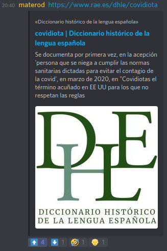

<!--
 Copyright (c) 2021 kraptor
 
 This software is released under the MIT License.
 https://opensource.org/licenses/MIT
-->

# PerLink Noise Bot

PerLink Noise is a small bot that tracks upvotes to links in discord channels by adding emojis to messages. Users only have to click on the emojis to update/downvote a link.

It uses as its database a Google Spreadsheet, so it's easy to extract realtime stats, etc. by administrators.

> 

## Development environment

In order to hack on the project you need `Poetry` installed:

* https://python-poetry.org/

Then you can initialize the development environment:

    > poetry install --no-root

Then check if tests passes:

    > poetry run pytest -v

## Configuration

> TLDR: copy the file `.env.example` to `.env` and customize. Then add the Google json auth file in the root folder as `perlink_auth.json`.

1) Create a `.env` file and set the options there. See an example here: 
2) The following options can be configured:
    * `DISCORD_TOKEN: str`
        * Obtain a discord token for your bot and put it here.
        * **NO DEFAULTS. MANDATORY VALUE**

        * [Instructions on how to obtain a token](https://discordpy.readthedocs.io/en/stable/discord.html#creating-a-bot-account).

        * [Instructions on how to invite the bot to your server](https://discordpy.readthedocs.io/en/stable/discord.html#inviting-your-bot)
            * In the `SCOPES`section within `OAuth2` tab, select the scope `bot`.
            * In the `Bot Permissions`section, select the following permissions:
                * `Read Message History`
            * Copy the link generated, and paste it on your browser. Example of link: `https://discord.com/api/oauth2/authorize?client_id=XXXXXXXXXXXXXXX&permissions=XXXXX&scope=bot`
    * `DATABASE_FILE: str`
        * **NO DEFAULTS. MANDATORY VALUE**
        * Open the following Google Spreadsheet template: <https://docs.google.com/spreadsheets/d/1Jb1XW67xoftwD34kADYGX7-D04NiCqQa2hIZ3NjKapo/edit?usp=sharing>
        * Create a copy on your Google Drive (File -> Create copy)
        * From the copy created, get the file ID from the URL:
            * Example:
                * for this file: `https://docs.google.com/spreadsheets/d/1Jb1XW67xoftwD34kADYGX7-D04NiCqQa2hIZ3NjKapo/`
                * The id is the following: `1Jb1XW67xoftwD34kADYGX7-D04NiCqQa2hIZ3NjKapo`
        * Share the file to the email within in the `GOOGLE_AUTH_FILE` (see below) as `client_email`.

    * `GOOGLE_AUTH_FILE: str`
        * Specifies the name of the service account json file to use for Google credentials.
        * Default value: `perlink_auth.json`
        * [Create a bot service account json file](https://docs.gspread.org/en/latest/oauth2.html#for-bots-using-service-account) and put it in the configured location. **IMPORTANT**: be careful with the json file, every document you grant access to the service account can be read/modified with the contents of the json file.
        * **NOTE**: You need to share the Google Spreadsheet with the `client_id` within the json file.
    * `MAX_VOTE_HOURS: int`
        * How long for the bot to look back in time to count votes. All votes before that period are not counted.
        * Default value: `24`
    * `DETECT_RAW_LINKS: bool`
        * If the bot will try to find links that are not properly written (for example, missing the schema: `itch.io` instead of `https://itch.io`).
        * Default value: `false`
    * `ALLOW_NSFW_CHANNELS: bool`
        * Lets the bot collect votes from NSFW channels or not.
        * Default value: `false`
    * `VALID_LINK_PROTOCOLS: str`
        * Which links are considered valid (when `DETECT_RAW_LINKS` is disabled).
        * Separate multiple values with commas "`,`".
        * Default value: `http,https,ftp`
    * `IGNORE_LINKS_WITH_SECRETS: bool`
        * Let the bot ignore links that contain secrets (users/passwords) in the URIs.
        * Default value: `true`
    * `BOT_ID: str`
        * This is the bot id, should you use several bots within the same asyncio loop.
        * Default value: `perlink`
    * `LOG_FORMAT: str`
        * The log format used.
        * Default value: `%(asctime)s [%(process)d] %(name)-30s | %(levelname)8s %(message)s`

## Run the bot

    poetry run python -m perlink

## Deploying (TODO)

### Heroku (TODO)
